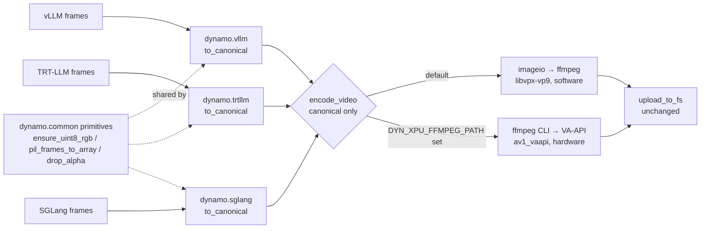

# Unified Video Encoder for Dynamo Diffusion Backends

**Status**: Draft

**Authors**: Sergey Plotnikov

**Category**: Architecture

**Replaces**: N/A

**Replaced By**: N/A

**Sponsor**: [Name of code owner or maintainer to shepard process]

**Required Reviewers**: [Names of technical leads that are required for acceptance]

**Review Date**: [Date for review]

**Implementation PR / Tracking Issue**: https://github.com/ai-dynamo/dynamo/pull/11121

# Summary

Dynamo serves video generation through three backends — **vLLM** (via vLLM-Omni),
**TensorRT-LLM**, and **SGLang** — and each one re-implements the final "raw
frames → encoded video" step with its own codec and hardware assumptions. This
DEP replaces those three implementations with a single shared encoder,
`dynamo.common.utils.video_utils.encode_video()`, that takes one canonical frame
format and emits mp4 bytes.

The encoder ships two royalty-free encoders and no codec matrix: **software VP9
by default**, and **hardware AV1 over VA-API** when the operator points
`DYN_XPU_FFMPEG_PATH` at a VA-API-capable ffmpeg.

# Motivation

The three backends share the frontend, the request schema, and the storage layer.
Encoding is the only genuinely divergent step, so adding hardware or a codec is
an N-times change today and produces inconsistent output across backends.

The first draft of this DEP proposed preserving the existing NVENC H.264 path and
adding HEVC alongside it. That is no longer possible: upstream PR #11836 removed
every royalty-bearing encoder from the shipped images, including `h264_nvenc`,
and added a build-time gate (`container/compliance/`) that fails the build if one
returns. The in-tree ffmpeg is now LGPL-only. So the unified encoder is not
"everything we had, plus more" — it is a **narrower, royalty-free codec surface**
that happens to be identical across all three backends, with hardware encode
reached through AV1 rather than H.264.

## Goals

* One shared frames→bytes entry point for all three backends.
* A single narrow input contract, so the shared layer holds no backend knowledge.
* Hardware encode on Intel XPU without reintroducing a royalty-bearing codec.
* Deployment-time selection of the encoder, with no silent fallback.

### Non Goals

* Changing the frontend, request schema, or storage layer.
* Any codec or container choice exposed to the caller or the request.
* Capability auto-detection.
* Removing the superseded helpers (`encode_to_mp4`, `encode_to_video_bytes`,
  `normalize_video_frames`, `frames_to_numpy`) — they retain their tests and no
  longer sit on any request path, but deleting them is a separate cleanup.

# Proposal

## Current implementation

Stages before and after encoding are already shared: the frontend routes
`/v1/videos`, `NvCreateVideoRequest` / `VideoNvExt` is the common schema, and
`upload_to_fs()` persists the bytes. Only the encode step diverges.

| | vLLM (vLLM-Omni) | TensorRT-LLM | SGLang |
|---|---|---|---|
| Encode call | `DiffusionFormatter._encode_video()` | `encode_to_video_bytes()` (shared helper) | `_frames_to_video()`, inline in the handler |
| Mechanism | diffusers `export_to_video` → ffmpeg | `imageio.v3.imwrite` → ffmpeg | `imageio.get_writer` → ffmpeg |
| Codec | H.264, software | H.264 NVENC; VP9 for webm | H.264 NVENC |
| Native frame type | `stage_output.images`, a list holding one 5-D array | `torch.Tensor (1, T, H, W, C)` uint8 | `list[PIL.Image \| np.ndarray]` |

Three encoders, three native frame layouts, and codec choices that no longer
exist in the shipped images.

## Proposed architecture

### Canonical frame format

`encode_video()` accepts exactly one input and validates it on entry:
`np.ndarray`, shape `(T, H, W, 3)`, dtype `uint8`, range `0–255`, channel order
RGB.

Each backend owns a small `to_canonical()` next to the handler that produces the
frames, composed from shared canonical-domain primitives (`ensure_uint8_rgb`,
`pil_frames_to_array`, `drop_alpha`). Backend-specific shape knowledge stays in
the backend, so adding a fourth backend never edits `dynamo.common`, and the
shared encoder needs no runtime type sniffing.

### The two encoders

| | Default | Hardware |
|---|---|---|
| Encoder | `libvpx-vp9`, software | `av1_vaapi`, Intel VA-API |
| Driven by | imageio → the image's LGPL ffmpeg | the operator's ffmpeg, via CLI with raw frames on stdin |
| Selected when | `DYN_XPU_FFMPEG_PATH` is unset | `DYN_XPU_FFMPEG_PATH` names an executable |
| Container | mp4 | mp4 |

The container is always mp4; every backend already rejected anything else during
request validation, so this narrows nothing. Neither codec is royalty-bearing.
H.264 and H.265 are excluded in both software and hardware form — Intel media
engines can encode them, but doing so would put a royalty-bearing surface back
into a distributed image, which is exactly what the compliance gate forbids. VP9
is decode-only on current Intel silicon, so it has no hardware path; AV1 gives us
hardware encode without the licensing problem.

The CLI is required for the hardware path because imageio's ffmpeg plugin does
not expose VA-API device selection or hardware filter chains (`format=nv12,hwupload`).

Two environment variables, both read by the shared encoder:

| Variable | Meaning | Default |
|---|---|---|
| `DYN_XPU_FFMPEG_PATH` | Path to a VA-API-capable ffmpeg. Its presence is the only encoder switch. | unset → software VP9 |
| `DYN_XPU_VIDEO_DEVICE` | DRM render node for VA-API. | `/dev/dri/renderD128` |

Selection is deliberately **not** auto-detected. `ffmpeg -encoders` advertises
wrappers the driver cannot run — `vp9_vaapi` lists cleanly and then fails at
runtime with "No usable encoding entrypoint found" — so probing yields false
positives. The operator declares hardware support by setting the path.

## Error handling

Every failure is raised, and **no failure falls back to the other encoder**.

| Condition | Result |
|---|---|
| `frames` is not canonical `(T, H, W, 3) uint8` | `ValueError`, before any encoder runs |
| `DYN_XPU_FFMPEG_PATH` set but not an executable file | `RuntimeError` naming the variable and both alternatives |
| Hardware ffmpeg exits non-zero | `RuntimeError` including ffmpeg's stderr |
| `imageio` not importable | `ImportError` with the install hint |

The no-fallback rule is the load-bearing decision. A silent downgrade from
hardware to software would hide a deployment error behind a large, unexplained
change in encode cost and output characteristics: the operator asked for hardware
encoding and should hear that they did not get it. Frame validation raising
before dispatch means a backend converter bug surfaces as a precise contract
violation rather than as an opaque ffmpeg error.

`validate_video_encoder_config()` performs the same resolution and logs the
result, so a worker can report its encoder at startup instead of on the first
request. It is available but not yet wired into any worker's startup path.

## Tests

Encoder behaviour is tested once against canonical arrays, with no backend
knowledge; each backend tests only its own converter and handler adapter. All
suites are mocked apart from one real round trip, and all are marked `unit`,
`pre_merge`, `gpu_0` plus the backend marker, so CI's marker expressions pick
them up with no workflow change and no GPU.

**Added** — `common/tests/test_video_utils.py`:

| Group | Covers |
|---|---|
| `TestEncodeVideoValidation` | non-ndarray, wrong ndim, wrong channel count, wrong dtype all raise `ValueError` |
| `TestEncoderSelection` | software when unset, hardware when set, blank treated as unset, unusable path is a hard error with no software call, render-node default and override |
| `TestAv1VaapiCommandLine` | `av1_vaapi` selected, declared binary invoked, render node and `hwupload` present, quality set explicitly, mp4 output, non-zero exit raises with stderr |
| `TestValidateVideoEncoderConfig` | passes when unset, raises on a bad path |
| `TestEncodeVideoRoundTrip` | real encode → decode of a synthetic clip: mp4 magic, frame count, `W×H`, and a PSNR floor of 35 dB |

**Added** — per-backend converter round trips (`TestVllmVideoToCanonical`,
`TestTrtllmToCanonical`, `TestSglangVideoToCanonical` in each backend's `tests/`):
build a known-truth canonical array with distinctive per-pixel values, synthesize
the backend's real native shape from it, convert back, and assert bit-exact
equality. Distinctive values are what catch axis and channel-order bugs,
including a U/V swap.

**Changed** — handler adapter tests in all three backends now assert that
`encode_video` receives canonical frames and `fps` only, and that no `container`
or `codec` kwarg is passed, since neither is a caller choice any more. The
TRT-LLM suite's `output_format` kwarg assertions were replaced by the observable
result (`output_format == "mp4"` in the response). The vLLM formatter's patch
helper shrank from five patch targets to four as `normalize_video_frames` /
`frames_to_numpy` / `encode_to_video_bytes` gave way to `to_canonical` /
`encode_video`.

The round trip is the only test that touches a real bitstream, and it skips
rather than fails when no encoder or decoder is present.

# Alternate Solutions

## Alt 1 — One shared converter in `dynamo.common`

A single `to_canonical_frames()` that sniffs all three backend shapes.

**Reason rejected:** it reintroduces the N-times coupling this DEP removes — a
new backend means editing shared code — and inverts the dependency direction, so
that shared infrastructure knows backend internals. Pushing conversion to the
producing edge fixes both.

## Alt 2 — Auto-detect the hardware encoder

Probe `ffmpeg -encoders` and use hardware when it appears available.

**Reason rejected:** the probe is unreliable. Advertised VA-API wrappers fail at
runtime on drivers that do not implement them, so auto-detection produces
confident false positives and an unpredictable encoder per host.

## Alt 3 — Expose codec and container per request

**Reason rejected:** the shipped images carry exactly one software and one
hardware encoder, both mp4. A codec parameter would be a promise the deployment
cannot keep, and it would make the response format depend on the request rather
than on the deployment.

## Alt 4 — Status quo

**Reason rejected:** keeps three encoders and the N-times change, and two of the
three still name codecs that the shipped images no longer contain.
