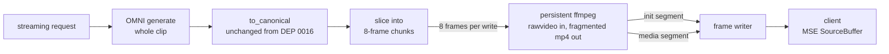

# CMAF Streaming for Dynamo Video Generation

**Status**: Draft

**Authors**: Sergey Plotnikov

**Category**: Architecture

**Replaces**: N/A

**Replaced By**: N/A

**Sponsor**: [Name of code owner or maintainer to shepard process]

**Required Reviewers**: [Names of technical leads that are required for acceptance]

**Review Date**: [Date for review]

**Implementation PR / Tracking Issue**: [To be filed]

# Prior Art

This DEP builds on an **unmerged** proof of concept by @jpohl-nv, on two branches
of `ai-dynamo/dynamo`:

| Branch | PR | Contribution |
|---|---|---|
| `jpohl/streaming-poc` | #8606 | The original end-to-end CMAF streaming prototype |
| `jpohl/streaming-cmaf-minimal` | #8616 | The same path reduced to a minimal CMAF implementation |

**Neither PR was merged.** Nothing from them is on `main`, so this work is a
first landing rather than a refactor of shipped code, and the POC cannot be
treated as a compatibility constraint.

The POC is nonetheless the source of this design's load-bearing choices, and they
are adopted deliberately rather than rediscovered: one long-lived ffmpeg per
request producing fragmented MP4 on a pipe, a separate route as the only trigger
for CMAF output, and binary length-prefixed frames instead of base64 over SSE.
Where this DEP departs from the POC it says so explicitly — the POC assembled the
presentation timeline on the client with `SourceBuffer.timestampOffset`, and this
design moves it into the muxer (see [Timeline](#timeline) and
[Alt 2](#alt-2--assemble-the-timeline-on-the-client)). Every later reference to
"the POC" in this document means these two branches.

Separately, the MJPEG route `POST /v1/videos/stream` (#6487, also from @jpohl-nv,
shipped in v1.0.0) is the existing streaming precedent in the frontend. The CMAF
route is its sibling, not its replacement.

# Summary

Video generation today is request/response: the client waits for the entire clip
to be generated, encoded, and persisted before it receives anything. This DEP
adds a **streaming entry point** that emits a CMAF fragmented-MP4 stream —
an init segment followed by media segments — so a browser can start playing after
the first segment instead of after the whole clip.

It builds directly on DEP 0016 (unified video encoder) and assumes the reader
knows it. Same canonical frame contract, same two royalty-free encoders, same
no-fallback error policy. What changes is the encoder's *lifetime and output
shape*: one long-lived ffmpeg process per request producing fragmented MP4 on a
pipe, instead of one `subprocess.run` producing a complete file.

# Motivation

For the test vehicle — Wan2.1-T2V at its defaults, 97 frames at 16 fps,
832×480, about six seconds of video — the client currently sees nothing until
generation, encoding, and the storage write have all completed. Nothing about
the pixels requires that: the first half-second is playable long before the last
frame exists.

Streaming also establishes the transport that per-chunk generation needs later.
Once vLLM-OMNI can emit frames during generation, only the *source* of the frames
changes; the chunking, encoding, and delivery path in this DEP is unchanged. That
is the main reason to build it now, and the main constraint on how it is built.

## Goals

* Deliver a playable CMAF stream while encoding is still in progress.
* Reuse DEP 0016's frame contract, encoder selection, and error policy unchanged.
* Support **both** encoders — software VP9 and hardware AV1 — with no feature gap.
* Produce a stream whose timeline is authored by the muxer, not reconstructed by
  the client.
* Keep the design unchanged when frames later arrive incrementally.

### Non Goals

* Any change to the vLLM-OMNI project. It is called exactly as DEP 0016 calls it,
  and returns the whole clip. Dynamo's own OMNI integration — the handler, stage
  router, and output formatter under `dynamo/vllm/omni/` — does change.
* Audio. Single video track only.
* Per-chunk generation. Chunking happens after the clip is received.
* Changes to the existing `/v1/videos` route or to `encode_video()`.
* A DASH or HLS manifest, multiple renditions, or ABR.

# Proposal

Dynamo-side only. A **separate streaming entry point** —
`POST /v1/videos/stream/cmaf` — is what selects CMAF output; the existing routes
keep their current behaviour. Requesting that endpoint is the trigger; there is no
request field or env var that switches any other route's output shape.



## What changes on top of DEP 0016

| | DEP 0016 | This DEP |
|---|---|---|
| Canonical `(T, H, W, 3) uint8` contract, all three `to_canonical()` | — | unchanged |
| `hw_ffmpeg_path()`, `xpu_video_device()`, env-var policy | — | unchanged, plus two new variables |
| Encoder identities and VA-API arguments | — | unchanged, plus low-latency arguments on the streaming path only |
| No-fallback error policy | — | unchanged, extended to mid-stream failures |
| `encode_video()` | whole clip → complete mp4 bytes | untouched; CMAF adds a sibling |
| Video response protocol | untagged payload | adds one optional CMAF tag field; see Transport |
| Process model | `subprocess.run`, one shot | `asyncio.create_subprocess_exec`, one long-lived process per request |
| Output target | temp file, read back after exit | `pipe:1`, read while encoding |
| Muxing | plain mp4 | fragmented: `+frag_keyframe+empty_moov+default_base_moof` |
| `+faststart` | set | dropped — requires a seekable output |
| Keyframes | encoder default | `-g 8 -keyint_min 8`, aligned to segment boundaries |
| Software encoder | imageio | ffmpeg CLI, same as hardware |

Command construction is extracted into one builder shared by `encode_video()` and
the streaming session, so codec, quality, and VA-API decisions stay in a single
place.

## Chunking

Eight frames per segment — 500 ms at 16 fps — overridable with
`DYN_CMAF_GOP_FRAMES`, whose value **must be a positive multiple of four**.

Eight rather than four because each segment carries a keyframe: a 250 ms segment
doubles keyframe density to buy a start-up latency no viewer distinguishes from
500 ms.

The multiple-of-four requirement is about how frames will arrive once generation
streams, and it is worth stating precisely, because it is not boundary
coincidence. Wan2.1's VAE is causal with a temporal stride of 4: `num_frames` is
`4n + 1`, the first latent frame decodes to a single pixel frame, and every later
one decodes to four. Frames therefore arrive as 1, 4, 4, 4, …, and cumulative
arrival boundaries fall at `4m + 1` — never on a multiple of 4. Segment
boundaries at multiples of 8 never coincide with one, so the phase is off by a
frame permanently. What holds instead:

* **The rate matches.** A segment consumes exactly two arrival groups in steady
  state. The first consumes three: 1 + 4 + 4 = 9 frames, of which it uses 8.
* **The phase does not, and that is harmless.** One frame is always carried into
  the next segment — constant, never growing.
* **Latency is unaffected.** A segment ends at frame `8k`, and `8k + 1` is an
  arrival boundary, so each segment is ready the moment its final arrival group
  lands.

A segment size that is not a multiple of four loses only the first property: the
carry begins to vary — 3, 1, 3, 1 … for a 6-frame segment — instead of staying at
one frame. So the requirement buys a constant buffer, not aligned boundaries.
Nothing in the encoder command changes either way; keyframes at multiples of the
segment size are what `-g` already produces. The requirement is enforced where the
value enters the process, when `DYN_CMAF_GOP_FRAMES` is read.

Making the first segment 9 frames would align the phase, but it needs forced
keyframes at `8k + 1` rather than a constant GOP, and saves one frame of buffer
while latency is already minimal.

The permanent one-frame offset surfaces at the end of the clip: 97 frames gives
twelve 8-frame segments and a **1-frame final segment**. Requests are not obliged
to use the model default — `num_frames` may come from `seconds × fps` — so the
chunker must handle any remainder, and that degenerate tail is the interesting
test case rather than the happy path.

## Encoder session

One ffmpeg process per request, frames written 8 at a time, fragments read off
stdout as they complete:

```
ffmpeg -f rawvideo -pix_fmt rgb24 -s WxH -r FPS -i - \
       [-vaapi_device $DYN_XPU_VIDEO_DEVICE -vf format=nv12,hwupload] \
       -c:v {av1_vaapi | libvpx-vp9} -g 8 -keyint_min 8 \
       -movflags +frag_keyframe+empty_moov+default_base_moof \
       -flush_packets 1 -f mp4 pipe:1
```

The two encoders differ only in `-c:v` and the VA-API bracket. `-g 8` places a
keyframe at each boundary and `-frag_keyframe` cuts the fragment there, so
segment length is ours rather than an ffmpeg heuristic.

Each encoder also takes low-latency arguments, **on the streaming path only** —
the batch encoder of DEP 0016 keeps its current arguments exactly:

| Encoder | Streaming arguments | Why |
|---|---|---|
| `libvpx-vp9` | `-deadline realtime -cpu-used 8` | at 832×480 the libvpx default encodes six seconds of video in appreciably more than six seconds, which makes streaming pointless as a latency feature |
| | `-lag-in-frames 0 -auto-alt-ref 0` | libvpx looks ahead 25 frames by default, so finished fragments are withheld regardless of encode speed |
| | `-row-mt 1` | row-level threading, to recover some of the quality budget `-cpu-used 8` spends |
| | `-pix_fmt yuv420p` | from rgb24 input libvpx picks 4:4:4, which is VP9 profile 1, and browser MSE support for `vp09.01` is not dependable; this matches the 4:2:0 the hardware path already produces via `format=nv12` |
| `av1_vaapi` | `-async_depth 1` | the VA-API encoder queues frames before returning packets, which holds a finished fragment back |

| Variable | Meaning | Default |
|---|---|---|
| `DYN_XPU_FFMPEG_PATH` | VA-API ffmpeg; presence selects hardware AV1 (DEP 0016) | unset → software |
| `DYN_XPU_VIDEO_DEVICE` | DRM render node (DEP 0016) | `/dev/dri/renderD128` |
| `DYN_FFMPEG_PATH` | **New.** Software ffmpeg, now required because the CMAF path does not use imageio. | `/usr/local/bin/ffmpeg` |
| `DYN_CMAF_GOP_FRAMES` | **New.** Frames per segment; a positive multiple of four (see Chunking). Also sets `-g` / `-keyint_min`. | `8` |

> `/usr/local/bin/ffmpeg` is the LGPL build the runtime images ship and the only
> ffmpeg location the codec-compliance policy permits. Images lacking it cannot
> serve the software CMAF path.

## Timeline

The timeline is authored **server-side, by ffmpeg**. Because one muxer sees every
frame, `tfdt.baseMediaDecodeTime` and `mfhd.sequence_number` are continuous and
there is exactly one `moov`, with no post-processing of the bitstream by us.

This is a deliberate reversal of the POC, which assembled the timeline on the
client with `SourceBuffer.timestampOffset`. That worked for video alone and broke
audibly once audio was added: segment durations for the two tracks do not divide
evenly, so per-segment offsets accumulated a mismatch that was perceptible at
boundaries. Correct A/V interleaving on one timeline is a muxer's job, and
reconstructing it outside the muxer — on the client or by patching boxes on the
server — is the failure this design removes. Audio is out of scope here, but the
timeline decision is what keeps it reachable.

Our only bitstream work is *reading*: parse top-level box headers on stdout to
find segment boundaries, and split the leading `ftyp`+`moov` into the init
segment. No box is modified.

## Transport

`POST /v1/videos/stream/cmaf` in the Rust frontend, with the binary framing the
POC already uses: each frame is `[kind: u8][length: u32 big-endian][payload]`.

| Kind | Frame | Payload | When |
|---|---|---|---|
| `0x01` | `metadata` | JSON: `mime_type`, `video_codec`, `width`, `height`, `fps`, `target_duration`, `segment_count` | once, first frame on the stream |
| `0x02` | `init` | `ftyp` + `moov` | once, before any media |
| `0x03` | `segment` | one `moof` + `mdat` | per chunk |
| `0x04` | `error` | UTF-8 message | on failure, immediately before `done` |
| `0x05` | `done` | — | last frame on every stream that reached the body |

Binary rather than base64-over-SSE: segments are already compressed, and base64
would add a third to every byte on a latency-motivated path.

The worker does not write frames. It returns ordinary video responses carrying one
new optional field — a CMAF tag, `cmaf:metadata`, `cmaf:init`, or
`cmaf:segment:{n}` — and the route maps each tag to its kind byte and emits the
framing. Only that internal worker → frontend hop is base64, because it is JSON;
the client-facing bytes are binary, which is the whole point of the framing. Adding
an optional field keeps the response type readable by frontends that predate CMAF.

The `metadata` frame exists because the MSE codec string cannot be a constant — it
is `av01.*` or `vp09.*` depending on which encoder the deployment resolved. It is
read from the init segment's own sample entry (`av1C` / `vpcC`), falling back to a
per-encoder constant if that parse fails so the client always has something to pass
to `MediaSource.isTypeSupported()`, which it must call before appending.
`segment_count` is known today only because the whole clip is generated before
chunking; it is nullable, and becomes null once generation streams, so a client must
key end-of-stream off the `done` frame either way.

## Client

`examples/custom_backend/cmaf_binary_video_streaming/` carries the reference
client:

| File | Role |
|---|---|
| `client.html` | Browser MSE player: reads the frames, checks `isTypeSupported()` against the metadata mime type, appends init then segments to one `SourceBuffer` |
| `cmaf_client.py` | Headless client: same framing, reassembles to a file, for testing without a browser |
| `run_proxy.py` | Serves the page and forwards the API on a single origin |
| `README.md` | How to run the three of them |

The proxy is there for a real constraint rather than for convenience: the Dynamo
frontend sends no CORS headers, so a page served from `file://` or any other origin
cannot read the stream at all. Same-origin delivery is a requirement for any
browser client of this route, not a property of this example.

## Error handling

Two regimes, split by whether anything has been committed to the wire. The split is
**not** at the init segment, and the distinction matters: the status line and
headers are written when the response body is constructed, before any frame exists,
so everything after that point is a 200.

| When | Behaviour |
|---|---|
| Before the engine stream starts — malformed body, frontend not ready, unknown model, engine refuses the request | ordinary HTTP error; nothing has been committed |
| After — any worker or encoder failure, *including one that happens before the init segment* | terminal `error` frame carrying the message, then `done`; the client surfaces the failure and calls `endOfStream()` |

`done` follows `error` rather than replacing it so that the last frame of a stream
is unconditional and a reader always sees a well-formed tail. `error` is
authoritative: a client that has seen it stops there and does not treat the
following `done` as success.

A bare end-of-stream is never acceptable after a failure: it is
indistinguishable from success, so a fault at segment 9 of 13 would silently
deliver a truncated video that looks complete. The same reasoning covers a worker
that does not implement CMAF at all: it ignores the annotation and returns ordinary
untagged responses, which would otherwise produce an empty but successful stream, so
the route counts what it emitted and substitutes an explicit `error` frame naming
the likely cause when nothing was tagged. That is the N-2 mixed-version obligation
in `lib/llm/AGENTS.md` — a new frontend against an older worker must fail
legibly rather than silently.

No mid-stream fallback, extending DEP 0016's policy. Switching encoders after the
init segment has gone out would invalidate the codec configuration the client is
already decoding against, so a chunk failure aborts the stream.

## Process lifecycle

The persistent process is the one part of this that must be written carefully:

* **Three pipes are pumped concurrently.** Writing stdin while ffmpeg blocks on a
  full stdout pipe deadlocks. Needs a writer task plus separate stdout and stderr
  readers — `subprocess.run` handled this for us and no longer does.
* **One process per in-flight request**, terminated on client disconnect, bounded
  by a timeout, and reaped on every exit path.
* **Mid-stream failure** appears as a non-zero exit with stderr captured
  separately, which becomes the `error` frame's message.

## Tests

Unit tests, no encoder started and no GPU required:

| Area | What it checks |
|---|---|
| Chunk slicing | 97 frames → 12 + 1, the single-frame tail, every frame covered in order, exact multiples leave no tail, a non-positive size is rejected |
| Segment length | the default, a blank value treated as unset, an override, and rejection of anything that is not a positive multiple of four; segment seconds follow the frame rate |
| Wire vocabulary | segment tags are 1-based; the metadata payload carries the codec string as a `mime_type` MSE accepts, the geometry, and a nullable `segment_count` |
| Command construction | the shared builder emits the fragmented-MP4 flags, `-g` / `-keyint_min`, the right `-c:v`, low-latency arguments and VA-API bracket per encoder, no `+faststart` — and leaves the batch argv of DEP 0016 untouched |
| Encoder resolution | hardware wins when `DYN_XPU_FFMPEG_PATH` is set and carries the render node; software otherwise and with no device; a missing software binary raises |
| Codec string | `av1C` → `av01.0.05M.08` and `vpcC` → `vp09.00.10.08` parsed out of a synthetic init segment; a missing sample entry or a truncated init falls back per encoder |
| Segment framing | a fragmented-MP4 byte stream splits into one `init` and N `segment` frames at exact boundaries, byte-at-a-time feeding included, unknown top-level boxes skipped, the tail flushed, an impossible box size rejected |
| Frame framing | every worker tag maps to its kind byte and an unknown tag is refused; the length prefix is big-endian and correct for an empty, small, and 300 KB payload |
| Formatter | frames carry tag and payload; metadata precedes init precedes segments; the metadata JSON matches the stream; a 20-frame clip yields chunks of 8, 8, 4 and four segment frames; a failure produces a failed response with no data; the encoder is closed when a push raises; an empty clip raises |

Verified by hand on the software path, not automated:

| Area | Why it is not a unit test |
|---|---|
| Round trip | needs a real encoder; covered by running the browser and headless clients against a live worker |
| Timeline | `tfdt.baseMediaDecodeTime` continuity and `mfhd.sequence_number` monotonicity are structural — one muxer instance sees every frame — so asserting them means asserting ffmpeg's own behaviour on a real encode |
| Lifecycle | client disconnect and orphan reaping need a live process; the failure path's `close()` is covered, the disconnect path is not |
| Route end to end | needs a running frontend and worker |

Automating the round trip with a skip-when-absent encoder guard, as DEP 0016 does,
is the obvious next increment and is deferred rather than rejected.

# Alternate Solutions

## Alt 1 — One ffmpeg invocation per chunk

**Reason rejected:** every invocation produces a self-contained file, so
`tfdt.baseMediaDecodeTime` restarts at 0, `mfhd.sequence_number` restarts at 1,
and each chunk carries its own `ftyp`+`moov`. Continuous server-side timestamps
would therefore require us to write an MP4 box rewriter — strip, patch, renumber
— which is more code and more risk than pumping three pipes, and reintroduces the
hand-authored timeline that this design exists to remove. It also pays a process
spawn and VA-API context init per segment and loses prediction across boundaries.

**Note:** it does not even buy fidelity to the future design. What is incremental
in per-chunk generation is the *input*; a persistent process is incremental on
both ends, and no final implementation would respawn ffmpeg thirteen times
mid-generation.

## Alt 2 — Assemble the timeline on the client

Send self-contained fragments and advance `SourceBuffer.timestampOffset`.

**Reason rejected:** this is what the POC did. It works for video-only and
produces perceptible audio distortion at segment boundaries once a second track
exists. See Timeline.

## Alt 3 — imageio for the software path

**Reason rejected:** `imwrite()` into a buffer returns only when encoding has
finished, so fragments cannot be read as they emerge. This holds even though
`output_params` can pass `-movflags` through — the blocker is the API's
completion semantics, not its flag surface. Using the CLI for both encoders also
removes the software/hardware asymmetry rather than adding one.

## Alt 4 — Base64 segments over the existing SSE route

**Reason rejected:** a third more bytes on a path whose entire purpose is
latency, and it overloads a route whose response shape is already specified.
A separate entry point is also the cleanest trigger for CMAF output.

## Alt 5 — Status quo

**Reason rejected:** keeps time-to-first-frame tied to the whole clip and leaves
no transport for per-chunk generation to land on.
